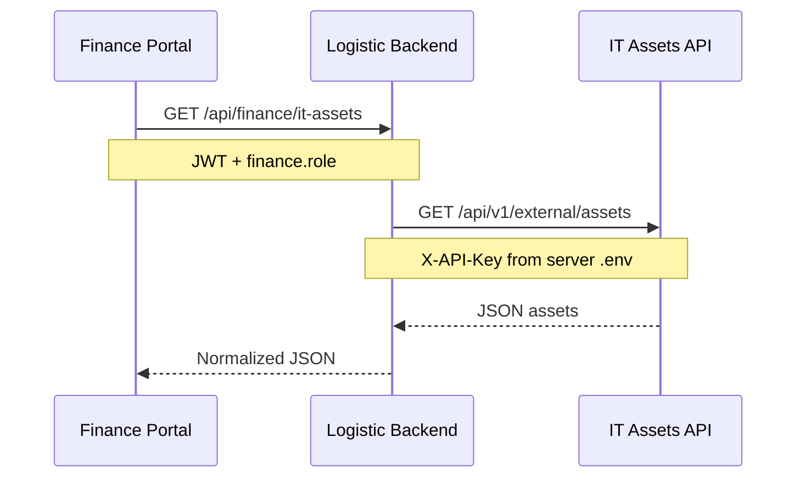

# IT Assets Integration (Future Phase)

This document describes how to add IT assets visibility for finance/grants users without exposing API keys in the browser.

## Recommended pattern: backend proxy



## Why proxy instead of direct frontend calls

- API keys stay in Laravel `.env` only
- Same auth model as existing finance routes (`finance.role`)
- Easier to add caching, rate limits, and field mapping in one place

## Backend steps (when implementing)

1. Add to `.env`:
   ```env
   IT_ASSETS_API_URL=https://it-backend.example.org/api/v1/external/assets
   IT_ASSETS_API_KEY=your-secret-key
   ```

2. Add to `config/services.php`:
   ```php
   'it_assets_api' => [
       'url' => env('IT_ASSETS_API_URL'),
       'key' => env('IT_ASSETS_API_KEY'),
   ],
   ```

3. Create `App\Http\Controllers\Api\ItAssetProxyController` with:
   - `GET /api/finance/it-assets` — list (supports `?updated_since=`)
   - `GET /api/finance/it-assets/{id}` — detail

4. Register routes under `jwt.auth` + `finance.role`.

5. Optional: `it_asset_cache` table + scheduled sync if IT API is slow or rate-limited.

## Frontend steps (when implementing)

1. Add sidebar item on donors portal: **IT Assets** → `/finance/it-assets`
2. Create read-only list/detail components (mirror assets list UX)
3. Add `ItAssetService` calling logistic backend proxy endpoints only

## Portal nav (future)

Extend [`portal-sidebar-data.ts`](../../frontend/src/app/layouts/full/sidebar/portal-sidebar-data.ts):

```typescript
{
  displayName: 'IT Assets',
  iconName: 'device-laptop',
  route: '/finance/it-assets',
  roles: ['finance'],
}
```

## Security checklist

- HTTPS only
- `finance.role` on all proxy routes
- Rate limit proxy endpoints
- Do not log API keys
- Map IT asset IDs to local display fields; avoid leaking internal IT system metadata not needed by finance
